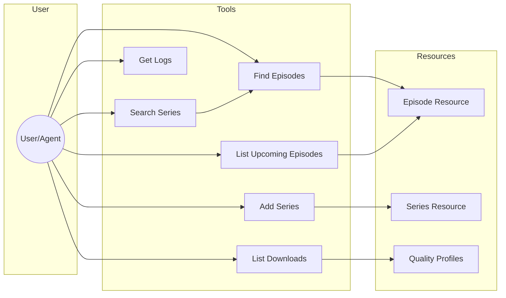

# Sonarr MCP Server

This is a [Model Context Protocol](https://modelcontextprotocol.org) (MCP) server for accessing Sonarr. It provides a set of tools for interacting with Sonarr programmatically and it's awesome!

## Available Tools

The following tools are available:

- `add-series`: Add a series to Sonarr
- `find-episodes`: Find episodes in Sonarr
- `get-logs`: Get paginated logs from Sonarr
- `list-recent-downloads`: List recent downloads from Sonarr
- `list-upcoming-episodes`: List upcoming episodes from Sonarr
- `search-series`: Search for a TV series by term

## Available Resources

The following resources are available:

- `episode`: Retrieve information about a specific episode by ID
- `quality-definition`: List quality definitions used by Sonarr
- `quality-profiles`: List quality profiles configured in Sonarr
- `series`: Retrieve information about a specific series by ID

## Usage

To add this server to your MCP config, add the following:

```json
{
  "mcpServers": {
    "sonarr": {
      "command": "npx",
      "args": ["-y", "sonarr-mcp"],
      "env": {
        "SONARR_URL": "http://localhost:8989",
        "SONARR_API_KEY": "<your-sonarr-api-key>"
      }
    }
  }
}
```

You can get your sonarr api key from the sonarr web ui under Settings > API > API Key.

Here's a diagram of how the tools and resources can be used:


